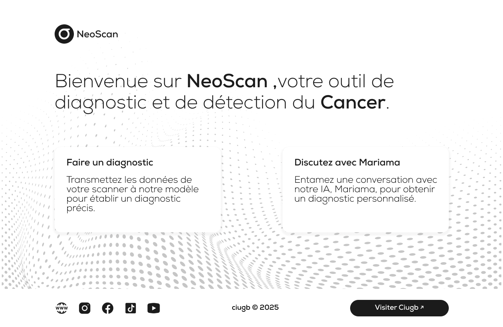

## NeoScan

 Néoscan a pour mission d’aider les professionnels et les patients à mieux comprendre leur état de santé grâce à l’analyse intelligente de données médicales.

## Mariama

Grâce à l’IA( MARIAMA), Néoscan est capable d’interpréter des radios médicales et d’apporter des pistes d’analyse claires sur ce qu’elles révèlent. Il peut aussi répondre à des questions sur la santé de manière personnalisée, en se basant sur les informations fournies.

## Conclusion

Néoscan vise à rendre l’expertise médicale plus accessible, tout en soutenant les professionnels dans leur diagnostic. Ce n’est que le début d’une belle aventure technologique et humaine.

